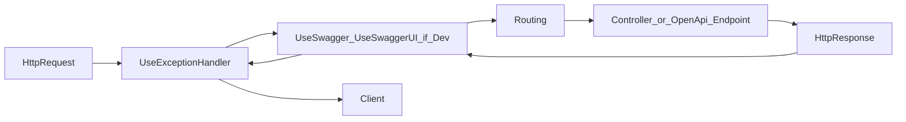
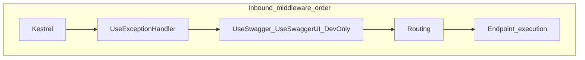

# Day 2 — ASP.NET Core Request Lifecycle + API Design

Back to the [main upskilling guide](../README.md).

## Daily plan (summary)

- **Focus:** routing, model binding, action results, status codes, API conventions
- **In project:** standardize responses + add global exception handling with `ProblemDetails`
- **Deliverable:** predictable API behavior across success and failure paths

### Timebox (4.5 h)

- 45 min lifecycle and middleware study
- 2h 15m response/error pipeline improvements
- 60 min negative API test scenarios (Swagger/Postman)
- 30 min Laravel ↔ .NET mapping notes

## What to practice today

These are the skills and habits that matter most for Day 2.

1. **Request pipeline order**  
   Know what runs before your controller: middleware sequence in `Program.cs` (exception handling, HTTPS, routing, endpoints). Understand *where* global error handling should live and why order matters.

2. **Routing and binding**  
   Practice `[Route]`, `[HttpGet]`, `[FromRoute]`, `[FromQuery]`, `[FromBody]`. Be able to explain how a URL maps to an action and how invalid models become `400` with `[ApiController]`.

3. **Consistent HTTP semantics**  
   Same situation → same status code every time: `200`/`201`/`204`/`400`/`404`/`409`/`500` (when you introduce conflict rules later). Avoid mixing plain strings and structured errors on the same API.

4. **`ProblemDetails` (RFC 7807-style errors)**  
   Learn `ProblemDetails`, `ValidationProblemDetails`, and how ASP.NET Core can produce them for validation failures. Goal: clients get a **stable JSON shape** for errors, not only ad-hoc message strings.

5. **Global exception handling**  
   Add middleware or `IExceptionHandler` (depending on .NET version/pattern you choose) so *unexpected* exceptions become a controlled `500` response with `ProblemDetails`, without leaking stack traces in production.

6. **Controller thinness**  
   Keep “what HTTP means” in the controller; keep domain rules in services. Day 2 is a good day to avoid growing controllers with stringly-typed error branches.

## Concepts to study (checklist)

Tick when you can explain each in one paragraph, using *this* project as an example.

- [x] **Middleware vs endpoint** — pipeline vs selected handler (routing + binding); see **Notes — (your space)** → **Middleware vs endpoint** for diagrams and the API routes tie-in

- [x] **`[ApiController]`** — automatic `400` for invalid models; binding source inference
- [x] **`IActionResult` vs `ActionResult<T>`** — when to use which
- [x] **`ProblemDetails` + `ValidationProblemDetails`** — fields (`type`, `title`, `status`, `detail`, `instance`, `errors`)
- [x] **Exception middleware / exception handler** — one place for unhandled exceptions
- [x] **Development vs production** — richer errors in dev, safer responses in prod

## In-project tasks (suggested order)

Work in `Program.cs`, `Controllers/UsersController.cs`, and any new middleware/handler files you add.

1. [x] **Audit current responses**  
   List each endpoint and document status codes for success and common failures (missing user, bad query, validation error).

2. [x] **Align error responses with `ProblemDetails`**  
   Replace or supplement raw `BadRequest("...")` / `NotFound("...")` where it makes sense with `Problem(...)` or typed `ProblemDetails` so clients get a consistent JSON shape.

3. [x] **Add global exception handling**  
   Catch unhandled exceptions once, log them, return `500` + `ProblemDetails` (no sensitive details in production).

4. [ ] **Confirm validation path**  
   Trigger a bad `POST` body and confirm you still get a clear `400` with validation details (built-in behavior + your consistency goals).

5. [ ] **Negative testing pass**  
   Run the scenarios in [Negative test ideas](#negative-test-ideas) below; note any inconsistent bodies or status codes and fix them.

## Negative test ideas

Use Swagger or Postman and record expected `status` + body shape.

| Scenario | Hint |
|----------|------|
| Invalid JSON or missing required fields on `POST /api/users` | Expect `400` + validation problem shape |
| `GET /api/users/{id}` for missing id | Expect `404` |
| `GET /api/users/by-email` with empty/missing `email` | Expect `400` |
| `GET /api/users/by-email` with unknown email | Expect `404` |
| `PUT` / `DELETE` for missing user | Expect `404` |
| Force an unhandled exception in dev (temporary throw) | Expect `500` + controlled `ProblemDetails`, not raw exception page in API |

## Laravel ↔ .NET (Day 2 angle)

- Laravel **middleware** (`app/Http/Kernel.php` stack) ↔ ASP.NET Core **middleware** in `Program.cs` (order matters similarly).
- Laravel **`Handler` / `render` / `report`** for exceptions ↔ global exception handler or exception middleware + logging in .NET.
- Laravel **`$request->validate()` errors** as JSON ↔ model validation + `ValidationProblemDetails` in .NET.
- Returning **`response()->json([...], 422)`** ↔ returning `Problem()` / `ValidationProblem` with explicit status codes in .NET.

## Completion checklist

Use this at the end of Day 2 to confirm you closed the loop.

- [ ] **Pipeline understood:** can sketch middleware order and where exceptions are handled
- [ ] **Responses standardized:** success and error paths use predictable status codes and JSON shapes
- [ ] **`ProblemDetails` in use:** at least validation and one error path use structured errors
- [ ] **Global handler added:** unhandled exceptions become safe `500` responses
- [ ] **Negative tests run:** documented or checked off against the table above
- [ ] **Notes captured:** short Laravel ↔ .NET comparison for middleware and errors
- [ ] **Retro done (10–15 min):** what to carry into Day 3 (EF Core)

## Notes — (your space)

_Add your own bullets below as you learn (serializer quirks, anything that surprised you)._

### Middleware vs endpoint — .NET 10 (`net10.0`, this repo’s `Program.cs`)

**One-line frame:** **Middleware** is code that runs on the way in and out of the request (exception handler, Swagger, etc.). An **endpoint** is the *final handler* the framework selects for that request—often a **controller action** after **routing** has matched the URL. The diagrams below are the **middleware / pipeline** side; the **API routes** subsection is the **endpoint** side (same request, later pipeline stage).

#### Pipeline and registration (what is *not* middleware)

- **`builder.Services.AddProblemDetails()`** and **`AddExceptionHandler<T>()`** register **services** (Problem Details writers + your `IExceptionHandler`). They are **not** middleware and do not run per request by themselves.
- **`app.UseExceptionHandler()`** adds **middleware**: it wraps everything registered **after** it. If a downstream controller or middleware throws and the exception propagates, this layer can run **`GlobalExceptionHandler`** and return structured errors.
- **`app.MapControllers()`** and **`app.MapOpenApi()`** **register endpoints** (routes + metadata). They do not replace the pipeline; **routing** still matches the URL and then **runs** the selected endpoint (e.g. `UsersController` action).
- **Typical API request flow:** Kestrel → **`UseExceptionHandler`** → (Development: **Swagger / SwaggerUI**) → **routing** → **endpoint** (controller action) → response unwinds through the same chain.
- **Build output** showing `net10.0` and `bin/Debug/net10.0/...` matches **`<TargetFramework>net10.0</TargetFramework>`** in the `.csproj` — same platform family as .NET 8, newer major; pipeline **concepts** stay the same; verify edge-case ordering against docs for your exact SDK if needed.

#### Typical API call (request in, response out)

#### Pipeline order (inbound chain)

The response travels **back** through **E → D → C → B** (then to Kestrel). If the endpoint **throws**, the exception can be handled when control unwinds to **`UseExceptionHandler`**.

#### API routes, URLs, and binding — how the endpoint is chosen and fed (`UsersController`)

**Tie-in to “middleware vs endpoint”:** After middleware like **`UseExceptionHandler`** (and dev Swagger), **routing** runs. It compares the request **path + HTTP method** to **registered endpoints** (`MapControllers()` registered your actions). The winning match is your **endpoint**—e.g. `GetUserById`. Only *then* does **`[FromRoute]` / `[FromQuery]` / `[FromBody]`** fill action parameters from the URL or body. So: **middleware** = cross-cutting pipeline steps; **endpoint** = the specific handler + its route template and binding rules.

- **Full path** = controller **`[Route("api/users")]`** + each action’s template (e.g. `"by-email"`, `"{id:int}"`, or nothing extra for the collection).
- **HTTP verb** (`[HttpGet]`, `[HttpPost]`, …) picks the handler when the path matches; same path + different verbs can map to different actions.
- **`{id:int}`** is a **route constraint**: only integer segments match (avoids treating `by-email` as an id because that action uses a **literal** segment instead).
- **`CreatedAtAction`** builds a **Location** URL from another action’s route (e.g. after `POST`, link to `GET` by id).

#### Binding: where parameters come from on the URL / body

| Attribute | Maps from | Example (this API) |
|-----------|-----------|----------------------|
| **`[FromRoute]`** | Named segments in the **path** | `GET /api/users/7` → `id` from `{id:int}` |
| **`[FromQuery]`** | **`?name=value`** after the path | `GET /api/users/by-email?email=a@b.com` → `email` |
| **`[FromBody]`** | **JSON** (or other content) in the **request body** | `POST` / `PUT` with `Content-Type: application/json` → `CreateUserDto` |

Rough URL anatomy: `https://host/api/users/42?foo=bar` → path `/api/users/42` (route values) + query `foo=bar` (query values). **Body** is separate from the URL (not shown in the address bar).

**This project’s routes (quick reference):** `GET/POST /api/users`; `GET/PUT/DELETE /api/users/{id}`; `GET /api/users/by-email?email=...`.

### `[ApiController]` — summary (`UsersController`)

**One paragraph (self-check):** `[ApiController]` on `UsersController` enables API conventions: failed validation on bound models becomes **400** with structured validation errors, and binding sources are inferred for common parameter shapes; routes still come from `[Route]` and HTTP method attributes (`[HttpGet]`, `[HttpPost]`, etc.). *Practical footnote for this repo:* invalid `POST`/`PUT` bodies against `CreateUserDto` hit that automatic path; empty `email` on `GET .../by-email` is handled explicitly with `Problem(...)` because a bare `string` query param does not go through the same DTO validation unless you introduce a small query model with `[Required]`.

### `IActionResult` vs `ActionResult<T>` — important notes + rule of thumb

#### Important notes

- `ActionResult<T>` works for MVC/Web API controllers and is especially useful with `[ApiController]` because it makes the success payload type explicit for API metadata/docs.
- If an endpoint does not return a response body on success (for example `204 No Content`), prefer `IActionResult` and return explicit results like `NoContent()`.
- Minimal APIs use different abstractions (`IResult`/typed results), so keep controller guidance (`IActionResult`, `ActionResult<T>`) separate from minimal API patterns.

#### Rule of thumb

- Use `ActionResult<T>` for read/data-returning endpoints with a stable success model (for example `UserDto`, `List<UserDto>`), while still returning `NotFound()`, `BadRequest()`, etc. on failures.
- Use `IActionResult` when the endpoint has no stable success body or intentionally returns varied response shapes/status-only outcomes.

### `ProblemDetails` + `ValidationProblemDetails` — what to know

#### `ProblemDetails` (general API errors)

- Use `ProblemDetails` for non-validation API errors such as `404`, `409`, and `500`.
- Core fields to recognize: `type`, `title`, `status`, `detail`, `instance`.
- Goal: keep a consistent JSON error envelope instead of mixing plain strings and custom ad-hoc shapes.
- In `UsersController`, `return Problem(title: ..., detail: ..., statusCode: 404)` is the controller helper that creates and returns a `ProblemDetails` payload.

#### `ValidationProblemDetails` (input/model validation errors)

- `ValidationProblemDetails` extends `ProblemDetails` and adds an `errors` dictionary (`field -> list of messages`).
- Typical use case is `400 Bad Request` when request input fails validation rules.
- With `[ApiController]`, invalid DTO/model input is commonly handled automatically with this shape.

#### Methods to use for `ValidationProblemDetails`

- **`ValidationProblem(...)`** (controller helper): use when you want to explicitly return validation errors from an action.
- **`ValidationProblem(ModelState)`**: common explicit form when you have model-state errors and want a consistent `ValidationProblemDetails` response.
- **Automatic `[ApiController]` path**: for invalid bound DTO/model input, ASP.NET Core can return `ValidationProblemDetails` without manual `if (!ModelState.IsValid)` checks.
- **`BadRequest(...)`**: valid for `400`, but prefer `ValidationProblem(...)` when the error is specifically validation-related and you want the standard `errors` dictionary shape.

#### Rule of thumb

- If the problem is about request data validity, return `ValidationProblemDetails` (`400`).
- If the problem is not validation (missing resource, conflict, unexpected exception), return `ProblemDetails` with the appropriate status code.

#### Project-oriented guidance

- Keep validation and non-validation error paths predictable for clients.
- Use global exception handling so unhandled exceptions become controlled `500` `ProblemDetails` responses.
- Avoid leaking internal implementation details in production `detail` messages.

### `Exception middleware` — what to know in this project

#### Current setup

- `Program.cs` registers exception services with `AddExceptionHandler<GlobalExceptionHandler>()` and enables the middleware with `app.UseExceptionHandler()`.
- `GlobalExceptionHandler` (`IExceptionHandler`) is the central place where unhandled exceptions are logged and transformed into a consistent `ProblemDetails` response.

#### Runtime behavior

- If a service/controller throws and does not catch the exception, it bubbles to the exception middleware.
- The middleware invokes `TryHandleAsync(...)` in `GlobalExceptionHandler`, which writes a `500` response and returns `true` to mark the exception as handled.
- In development, `detail` can include richer exception text; in production, keep details safe and generic.

#### Global vs local handling (rule)

- Handle expected API/domain outcomes locally (for example `404`, validation `400`, conflict `409`) using normal action responses.
- Do not add `try/catch` everywhere for the same generic fallback; let unexpected exceptions bubble to the global handler.
- Keep the global handler as the safety net for consistency, logging, and non-leaky `500` responses.

### `Development vs production` — current implementation and best-practice view

- `Program.cs` enables Swagger/OpenAPI only in development (`app.Environment.IsDevelopment()`), which matches best practice: rich API exploration tools for dev, reduced attack surface in production.
- `GlobalExceptionHandler` always returns a `ProblemDetails` envelope, which keeps the client-facing error contract consistent across environments.
- In development, `ProblemDetails.Detail` includes exception text for debugging speed; in production, it switches to a safe generic message to avoid leaking internals.
- Best-practice takeaway: keep diagnostics rich in server logs, keep API responses stable, and expose minimal sensitive detail to clients in production.

### Response audit snapshot (`UsersController`)

| Endpoint | Success | Common error responses |
|----------|---------|------------------------|
| `GET /api/users` | `200 OK` | Unhandled exceptions -> `500 ProblemDetails` (global handler) |
| `GET /api/users/{id}` | `200 OK` | Missing user -> `404 ProblemDetails` |
| `GET /api/users/by-email?email=...` | `200 OK` | Empty/missing `email` -> `400 ProblemDetails`; unknown email -> `404 ProblemDetails` |
| `POST /api/users` | `201 Created` | Invalid bound DTO/model -> `400 ValidationProblemDetails` (`[ApiController]` path); unhandled exceptions -> `500 ProblemDetails` |
| `PUT /api/users/{id}` | `200 OK` | Missing user -> `404 ProblemDetails`; invalid bound DTO/model -> `400 ValidationProblemDetails`; unhandled exceptions -> `500 ProblemDetails` |
| `DELETE /api/users/{id}` | `204 No Content` | Missing user -> `404 ProblemDetails`; unhandled exceptions -> `500 ProblemDetails` |
